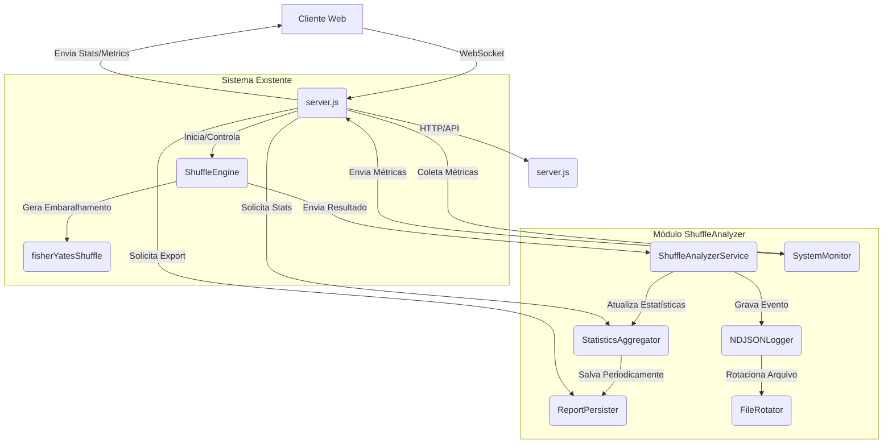

, baseada em limiares mais precisos da relação entre ordens únicas e total de embaralhamentos.

### 2.6. Heatmap

**Desafio**: Visualizar tendências de distribuição de cartas por posição de forma clara e eficiente.

**Estratégia Proposta**:
*   **Geração no Frontend**: O heatmap será gerado e atualizado no frontend usando HTML e CSS, com cores representando a frequência. Os dados de frequência serão enviados pelo backend via WebSocket.
*   **Normalização de Cores**: A intensidade das cores será normalizada com base na frequência máxima para garantir uma representação visual significativa.

### 2.7. Entropia

**Desafio**: Fornecer um indicador qualitativo da qualidade do embaralhamento.

**Estratégia Proposta**:
*   **Métrica Baseada em Unicidade**: A entropia será calculada com base na proporção de ordens únicas em relação ao total de embaralhamentos. Uma alta proporção indica maior aleatoriedade.
*   **Limiares Definidos**: Serão definidos limiares para classificar a entropia como "Excelente", "Boa", "Regular" ou "Ruim", fornecendo um feedback claro ao usuário.

### 2.8. Pares Adjacentes

**Desafio**: Detectar e contar a ocorrência de pares de cartas idênticas adjacentes.

**Estratégia Proposta**:
*   **Contagem Incremental**: A cada embaralhamento, o algoritmo verificará pares adjacentes e incrementará contadores específicos para cada tipo de par (e.g., "dragao-dragao").
*   **Exibição no Dashboard**: Os pares mais frequentes serão exibidos no dashboard, permitindo identificar vieses no embaralhamento.

### 2.9. Stress Test

**Desafio**: Monitorar o impacto do sistema em alta carga (100 a 10.000 embaralhamentos/segundo) em recursos do sistema.

**Estratégia Proposta**:
*   **Métricas de Sistema**: Além de CPU e RAM, o uso de disco (I/O) e throughput (embaralhamentos/segundo) serão monitorados. O uso de disco será relevante para a persistência NDJSON.
*   **Ferramentas Nativas**: Utilizar módulos nativos do Node.js (`os`, `process`) para coletar métricas de sistema e comandos de shell (`df`, `iostat` - se disponível) para métricas de disco.

### 2.10. Logs

**Desafio**: Registrar eventos importantes para depuração e auditoria.

**Estratégia Proposta**:
*   **Logs Estruturados**: Utilizar uma biblioteca de logging (e.g., `winston` ou `pino`) para gerar logs em formato JSON, facilitando a análise e o processamento automatizado.
*   **Eventos Registrados**: Início/parada do serviço, erros, avisos e estatísticas periódicas (e.g., a cada hora, um resumo das estatísticas será logado).

## 3. Arquitetura do Módulo ShuffleAnalyzer

O módulo ShuffleAnalyzer será implementado como um conjunto de serviços e utilitários que se integram ao `server.js` existente. A arquitetura proposta visa a modularidade e a mínima intrusão no código existente.

### Componentes Chave:

*   **`ShuffleEngine` (Existente)**: Responsável por gerar os embaralhamentos e notificar o `ShuffleAnalyzerService`.
*   **`ShuffleAnalyzerService` (Novo)**: O orquestrador do novo módulo. Recebe cada embaralhamento, o envia para o `StatisticsAggregator` e para o `NDJSONLogger`.
*   **`StatisticsAggregator` (Novo)**: Mantém e atualiza todas as estatísticas em memória (frequência por posição, pares adjacentes, etc.) de forma incremental. Expõe métodos para obter o resumo das estatísticas.
*   **`NDJSONLogger` (Novo)**: Responsável por gravar cada embaralhamento em um arquivo NDJSON. Gerencia a abertura/fechamento do stream de escrita e a rotação de arquivos.
*   **`ReportPersister` (Novo)**: Salva periodicamente as estatísticas agregadas do `StatisticsAggregator` em um arquivo `relatorio.json` para recuperação rápida.
*   **`FileRotator` (Novo)**: Um utilitário para gerenciar a rotação dos arquivos NDJSON, garantindo que não cresçam indefinidamente.
*   **`SystemMonitor` (Novo)**: Coleta métricas de CPU, RAM e uso de disco, expondo-as para o `server.js`.

## 4. Impacto em Notebooks Simples

A arquitetura proposta foi projetada para minimizar o impacto em notebooks simples:

*   **Baixo Consumo de RAM**: O processamento em fluxo e as estatísticas incrementais garantem que a memória RAM não cresça com o número de embaralhamentos. Apenas uma janela limitada de histórico e as estatísticas agregadas são mantidas em memória.
*   **I/O Otimizado**: A gravação em NDJSON é uma operação de `append` simples, que é eficiente e não exige reescritas de arquivos grandes. A rotação de arquivos evita que um único arquivo se torne excessivamente grande, o que poderia impactar o desempenho do sistema de arquivos.
*   **Carga de CPU Controlada**: O cálculo incremental das estatísticas é eficiente. O `Stress Test` pode, por natureza, consumir CPU, mas o sistema é projetado para escalar o uso de CPU conforme a taxa de embaralhamentos solicitada, sem introduzir gargalos inesperados.
*   **Recuperação Rápida**: A persistência periódica do `relatorio.json` permite que o sistema se recupere rapidamente após uma falha, sem a necessidade de reprocessar todo o histórico, o que seria intensivo em CPU e I/O.

## 5. Conclusão

O módulo ShuffleAnalyzer, com sua arquitetura baseada em processamento em fluxo, persistência NDJSON e cálculo incremental de estatísticas, oferece uma solução robusta e eficiente para monitorar e analisar milhões de embaralhamentos. As decisões arquiteturais visam garantir escalabilidade, resiliência e baixo consumo de recursos, tornando-o adequado para execução contínua em ambientes com recursos limitados, como notebooks simples, sem comprometer a integridade ou a disponibilidade dos dados. A integração será feita de forma modular, minimizando o impacto no código existente do Shuffle Lab.

## Referências

[1] NDJSON - Newline Delimited JSON: [http://ndjson.org/](http://ndjson.org/)
[2] Fisher-Yates Shuffle: [https://en.wikipedia.org/wiki/Fisher%E2%80%93Yates_shuffle](https://en.wikipedia.org/wiki/Fisher%E2%80%93Yates_shuffle)
