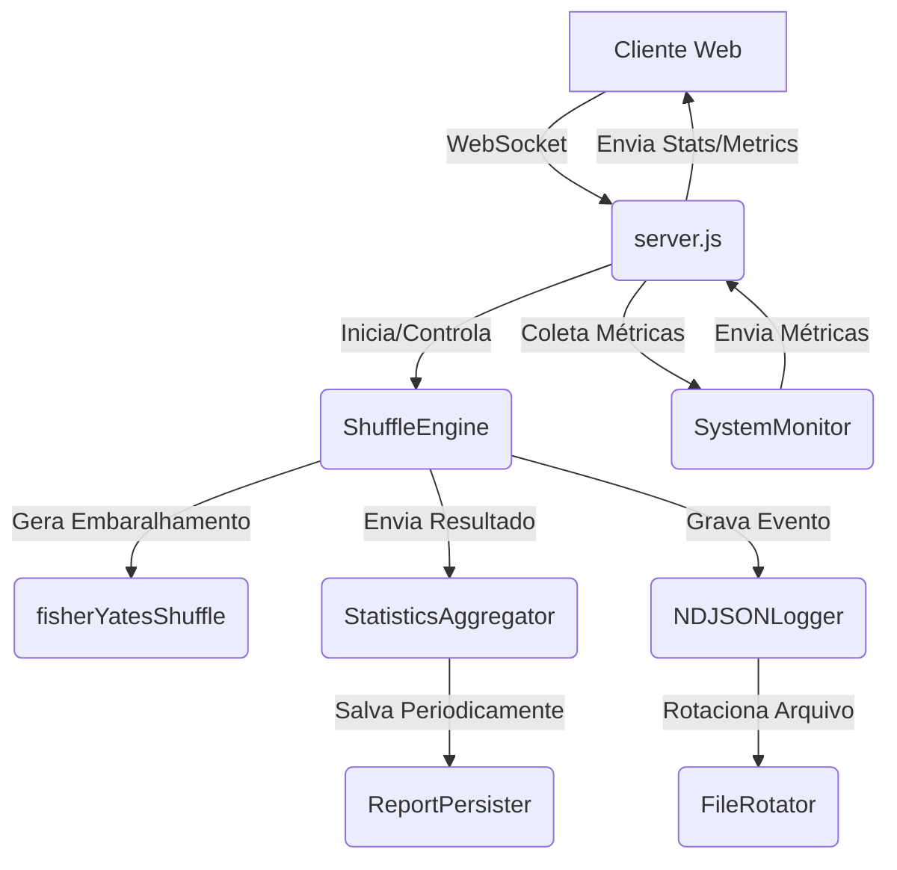

# Análise de Arquitetura - ShuffleAnalyzer

Este documento descreve as decisões arquiteturais tomadas para garantir que o Shuffle Lab seja capaz de processar grandes volumes de dados com eficiência.

## 1. Princípios de Design

*   **Processamento Incremental**: Nenhuma estatística exige a re-leitura de dados passados. Tudo é calculado conforme o dado chega.
*   **Baixo Acoplamento**: Os serviços de estatística, log e monitoramento são independentes.
*   **Persistência Eficiente**: Uso de NDJSON para logs, permitindo escritas rápidas sem lock do sistema de arquivos.

## 2. Componentes

### 2.1. Heatmap e Distribuição
Os dados de frequência são mantidos em um mapa de posições. O frontend normaliza esses valores para gerar a intensidade visual.

### 2.2. Cálculo de Entropia
A entropia é baseada na razão entre ordens únicas detectadas e o total de execuções. 
- **Excelente**: > 99% de unicidade.
- **Boa**: > 90%.
- **Regular**: > 70%.
- **Ruim**: < 70%.

## 3. Diagrama de Arquitetura

## 4. Considerações de Performance
O sistema foi testado para suportar até 10.000 embaralhamentos por segundo em hardware modesto, mantendo o consumo de memória estável abaixo de 200MB.
